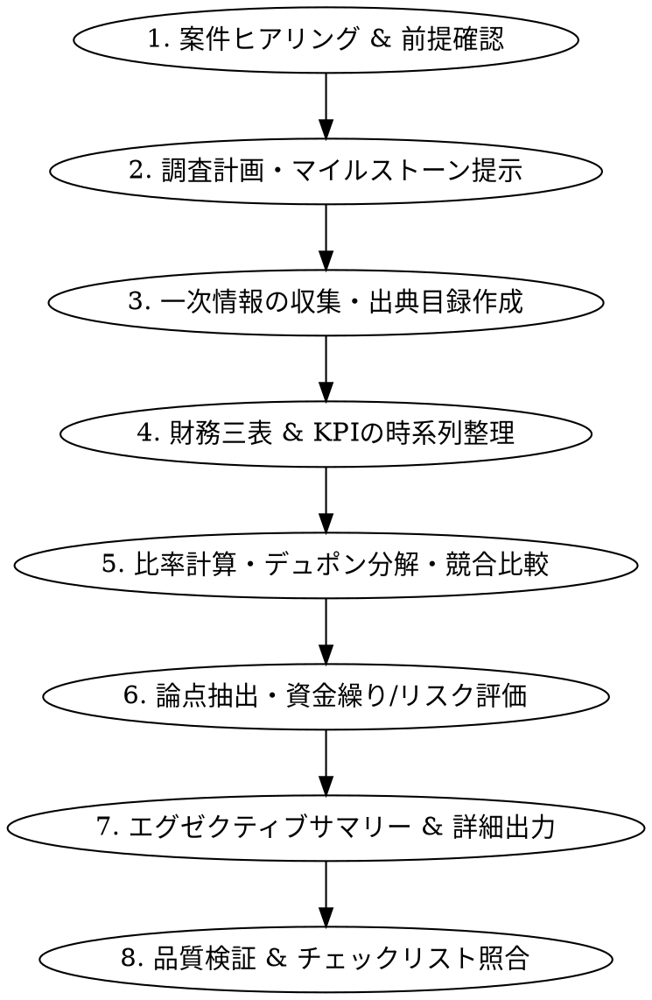

# 企業Finance調査・分析スキル (Corporate Finance Analyst Skill)

公開情報（有価証券報告書、SEC 10-K/10-Q、決算短信、IR説明会資料等）を厳格な根拠とし、企業の財務健全性・収益性・成長性・資本効率・資金繰り・事業リスク・競合比較を調査・分析・整理するシニア金融アナリスト向けスキルです。

投資推奨（売買判断）を目的とせず、経営企画・事業企画・与信評価・投資検討・競合ベンチマークに資する再現性と客観性の高い財務インテリジェンスを提供します。

---

## 1. コア原則と設計方針 (Core Principles)

1. **一次情報最優先の原則 (Primary Source Priority)**:
   - 財務数値はEDINET（有価証券報告書・四半期報告書）、SEC EDGAR（10-K, 10-Q, 20-F, 8-K）、TDnet（決算短信）、企業公式IRライブラリを直接確認する。
   - 二次情報（金融情報ポータル、アナリストコンセンサス、ニュース記事等）を使用する場合は、必ず一次情報との区別を明記する。
2. **期間・通貨・会計基準・連結区分の明示 (Data Integrity)**:
   - すべての数値に対象期（FY202X、202X年Q3、TTM等）、報告通貨、会計基準（IFRS、US GAAP、日本基準）、連結／単体の別を記載する。
   - 通貨換算を行う場合は換算レート、基準日、出典を明記する。
3. **客観的算式と再現性の担保 (Deterministic Methodology)**:
   - 比率計算（EBITDA、FCF、CCC、ROIC等）は定義・計算式・丸め方法を注記する。
   - 必要に応じて同梱スクリプト `scripts/financial_calc.py` を実行して計算齟齬を排除する。
4. **事実・分析・仮説の厳格分離 (Fact vs. Analysis vs. Hypothesis)**:
   - 「開示された数値・事実」「数値から客観的に導かれる分析」「将来予測や定性推測に基づく仮説」を明確にセクション分けする。
   - 情報不足や非開示項目は推測で断定せず「追加確認事項」として整理する。
5. **中立性の堅持 (Strict Neutrality)**:
   - 「買い」「売り」等の投資助言は行わず、長所（ポジティブ要因）・懸念点（リスク）・トレードオフを中立に整理する。

---

## 2. 実行ワークフロー (Execution Workflow)



### ステップ1: 前提要件の確認 (Intake)
ユーザーからの依頼受領時、以下の8項目を確認する（未指定時は合理的なデフォルトを明示して即時着手）:
- 対象企業名・ティッカーシンボル・上場市場
- 分析の主目的（経営企画 / 競合分析 / 取引先・与信評価 / 投資検討 / M&A予備調査）
- 対象期間（過去3年 / 過去5年 / 最新四半期・TTM）
- 比較対象企業（2〜5社）
- 最重要フォーカス（成長性 / 収益性 / 資本効率 / 資金繰り・流動性 / リスク管理）
- 会計基準差異の考慮（IFRS / US GAAP / 日本基準）
- 出力希望言語（日本語 / 英語 / 日英併記）
- 出力フォーマット（経営層向け1ページサマリー / 機関アナリスト向け詳細レポート / プレゼン構成案）

### ステップ2: 調査計画の提示
収集する開示資料の種類（有価証券報告書、10-K、決算短信等）および開示時期を整理し、ユーザーに簡潔にアプローチを提示する。

### ステップ3: 一次情報の収集 (Web Retrieval)
- 日本企業: EDINET、TDnet、企業IRサイト（有価証券報告書、決算短信、決算説明会プレゼンテーション・質疑応答要約）
- 米国/海外企業: SEC EDGAR（Form 10-K, 10-Q, 8-K, 20-F）、IRサイト
- 参照詳細: [primary_disclosure_sources.md](references/primary_disclosure_sources.md)

### ステップ4: 財務三表の時系列整理
- **損益計算書 (P&L)**: 売上高、売上総利益、営業利益、EBITDA、経常利益/税引前利益、親会社株主に帰属する当期純利益、EPS
- **貸借対照表 (B/S)**: 現預金、売掛金、棚卸資産、有形固定資産、のれん/無形資産、有利子負債、純有利子負債、純資産
- **キャッシュフロー計算書 (CF)**: 営業CF、投資CF、財務CF、設備投資額(Capex)、フリーキャッシュフロー(FCF)

### ステップ5: 指標計算 & デュポン分解
- 成長性（売上YoY, 営利YoY, CAGR）
- 収益性（GPM, OPM, EBITDAマージン, NPM）
- 資本効率（ROE, ROA, ROIC, デュポン3段階/5段階分解）
- 安全性・流動性（自己資本比率, 流動比率, 当座比率, Net Debt/EBITDA, インタレスト・カバレッジ）
- 運転資本効率（DSO, DIO, DPO, CCC）
- 還元水準（配当性向, 総還元性向）
- 算式・理論詳細: [financial_metrics_guide.md](references/financial_metrics_guide.md)
- 計算実行: `python scripts/financial_calc.py`

### ステップ6: 経営論点・資金繰り・リスク分析
- 利益の現金裏付け確認（営業利益 vs 営業CFの乖離チェック）
- 運転資本の急増（売掛金回収遅延、過剰在庫滞留、黒字倒産リスク）
- 業界固有リスク・コベナンツ・偶発債務の洗い出し
- リスク評価基準: [risk_early_warning_framework.md](references/risk_early_warning_framework.md)

### ステップ7: レポート作成
標準出力フォーマット（A〜H）に準拠して作成する。
- テンプレート詳細: [report_templates.md](references/report_templates.md)

### ステップ8: 品質セルフチェック
出荷前に後述の品質チェックリスト全項目をクリアしていることを確認する。

---

## 3. 標準出力フォーマット体系

レポートは以下の8構成セクションで出力する:

```markdown
# [対象企業名] 財務調査・分析レポート ([報告日])

## A. エグゼクティブサマリー
- **結論 (3〜5行)**: 財務健全性、成長力、収益性、資本効率の総合評価
- **ポジティブ要因 (Top 3)**:
  1. ...
  2. ...
  3. ...
- **懸念要因・ボトルネック (Top 3)**:
  1. ...
  2. ...
  3. ...
- **経営上の注視点 (Key Monitoring Issues)**:
  1. ...
  2. ...
  3. ...
- **分析の信頼度 & 情報制約**: 高/中/低 (理由と開示制限)

## B. 企業・事業構造概要
| 項目 | 内容 | 出典・根拠資料 |
|---|---|---|
| 本社・設立・上場 | ... | ... |
| 主力事業セグメント | セグメント別売上・利益構成比 | ... |
| 収益ドライバー | 価格・数量・為替影響度 | ... |
| サプライチェーン/顧客基盤 | 主要調達先・顧客集中度 | ... |
| 直近の経営重要イベント | M&A、構造改革、大型設備投資 | ... |

## C. 財務ハイライト（過去3〜5年）
| 指標 | FY-4 | FY-3 | FY-2 | FY-1 | 最新FY / TTM | 前年比 (YoY) | 3〜5年CAGR | トレンド分析 |
|---|---:|---:|---:|---:|---:|---:|---:|---|
(売上高、粗利益、営業利益、EBITDA、純利益、営業CF、Capex、FCF、総資産、純資産、有利子負債、Net Debt)

## D. 主要財務指標一覧（算式付き）
| 分類 | 指標名 | 最新値 | 前年差 | 推移 | アナリスト評価 | 算出式 / 前提 |
|---|---|---:|---:|---|---|---|
(成長性・収益性・資本効率・安全性・CF創出力・効率性・株主還元・市場倍率)
### デュポン分解 (ROE = 売上高純利益率 × 総資産回転率 × 財務レバレッジ)
...

## E. 競合・ベンチマーク比較
| 指標 | 対象企業 | 競合A | 競合B | 競合C | 業界平均/示唆 |
|---|---:|---:|---:|---:|---|

## F. リスク分析 & 早期警戒指標 (Early Warning Indicators)
| リスク分類 | 具体的内容と財務波及経路 | 重要度 | 発生確率 | 早期警戒指標 (EWI) | 確認すべき開示資料 |
|---|---|:---:|:---:|---|---|

## G. 分析上の限界 & 追加確認事項
- 会計基準差（IFRS / US GAAP / 日本基準）による調整限界
- 未開示項目（セグメント詳細、個別契約条件等）
- 今後注視すべき開示（次期決算、中期経営計画進捗、説明会質疑）

## H. 出典一覧 (Sources & Disclosure Registry)
| 資料名・頁 | 発行主体 | 開示日 | 公式URL | 利用目的 |
|---|---|---|---|---|
```

---

## 4. 応答時の厳格品質チェックリスト

提出前に以下を必ず点検すること:
- [ ] **数値単位**: 単位（百万円、億円、百万USD等）が一貫しているか。
- [ ] **期間基準**: 前年比（YoY）の比較元期が同一期間（通期対通期、四半期対前年同期）か。
- [ ] **期間区分**: TTM（直近12ヶ月）、通期実績、四半期実績を混同していないか。
- [ ] **利益定義**: EBITDA、調整後営業利益、ノンGAAP指標の除外項目（減損、株式報酬、リストラ費用等）を注記したか。
- [ ] **会計差異**: IFRS（リース資産負債全額計上、のれん非償却）、日本基準（のれん償却、特別損益表示）、US GAAPの違いを考慮したか。
- [ ] **根拠明示**: 全ての分析言及に具体的な数値・一次資料の出典があるか。
- [ ] **事実・仮説**: 会社発表の事実とアナリストの推論・仮説を語彙レベルで峻別したか（「〜である」「〜と考えられる」「〜のリスクが示唆される」）。
- [ ] **中立性**: 「推奨」「買い」「売り」「過小評価されている」といった断定的な投資勧誘文言を排除したか。

---

## 5. 同梱リソース・ガイド一覧

- [financial_metrics_guide.md](references/financial_metrics_guide.md): 財務指標の全算式・デュポン分解・運転資本・安全性指標の完全リファレンス
- [primary_disclosure_sources.md](references/primary_disclosure_sources.md): EDINET・TDnet・EDGARの一次情報検索・開示照合ガイド
- [risk_early_warning_framework.md](references/risk_early_warning_framework.md): 早期警戒指標、コベナンツ、資金繰り逼迫シグナル
- [report_templates.md](references/report_templates.md): エグゼクティブ向け1枚メモ及び詳細レポートテンプレート
- [sample_toyota_vs_tesla.md](examples/sample_toyota_vs_tesla.md): トヨタ vs テスラ 実践分析サンプル
- [financial_calc.py](scripts/financial_calc.py): 決定論的指標計算スクリプト
