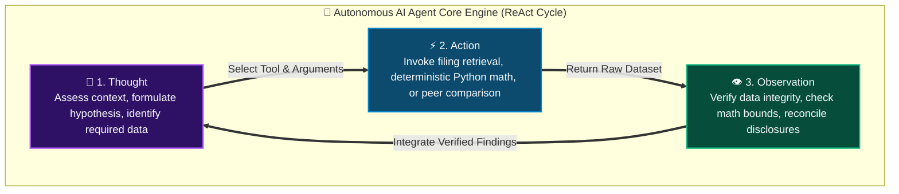

# FinReAct Intelligence Platform
## Autonomous Corporate Financial Research & Analysis AI Grounded in Statutory Disclosures

[](https://www.python.org/)
[](https://ai.google.dev/)
[](https://www.starlette.io/)
[]()
[]()
[]()
[]()

> [!CAUTION]
> ### ⚠️ MANDATORY LEGAL NOTICE, ACADEMIC RESEARCH DISCLAIMER & TERMS OF ACCESS
> 
> **1. STRICTLY FOR ACADEMIC & RESEARCH PURPOSES ONLY**  
> The **FinReAct Intelligence Platform** was conceived, designed, and developed **strictly as an experimental academic research and educational demonstration prototype** investigating autonomous Large Language Model (LLM) reasoning loops (ReAct), deterministic financial calculations, and automated primary filing synthesis.
> 
> **2. ABSOLUTE DISCLAIMER OF INVESTMENT ADVICE & LIABILITY**  
> Under no circumstances does this platform, its source code, documentation, or generated outputs constitute financial, investment, legal, tax, accounting, or regulatory advice. This application does NOT issue buy, sell, hold, or trading recommendations for any security or asset class under any financial regulatory jurisdiction (including, but not limited to, the US SEC, Japan FSA, France AMF, China CSRC, and Hong Kong SFC).  
> **THE AUTHORS, DEVELOPERS, RESEARCHERS, AND CONTRIBUTORS ASSUME NO RESPONSIBILITY OR LIABILITY WHATSOEVER FOR ANY DIRECT, INDIRECT, INCIDENTAL, CONSEQUENTIAL, SPECIAL, PUNITIVE, OR ECONOMIC LOSSES, LOST PROFITS, OR INVESTMENT DAMAGES OF ANY KIND INCURRED BY ANY INDIVIDUAL OR ENTITY ARISING DIRECTLY OR INDIRECTLY FROM THE USE, RELIANCE, INTERPRETATION, CONCLUSION, OR REUSE OF THIS APPLICATION, ITS DATA, OR ITS REPORTS.**
> 
> **3. CONDITIONAL ACCESS & DENIAL OF USE (TERMS OF USE)**  
> Access to and use of this repository, software, models, and generated deliverables is granted **strictly conditioned upon your unconditional, irrevocable acceptance of this disclaimer in full**.  
> **IF YOU DO NOT FULLY AND UNCONDITIONALLY AGREE TO, ALIGN WITH, AND ACCEPT THESE TERMS, YOU ARE STRICTLY FORBIDDEN AND DENIED PERMISSION TO ACCESS, CLONE, RUN, DEPLOY, REDISTRIBUTE, OR UTILIZE THIS APPLICATION, ITS CODEBASE, AND ITS OUTPUTS IN ANY FORM.**

---

## 1. Solution Overview

**FinReAct Intelligence Platform** is an institutional-grade corporate finance analysis solution. It operates directly on audited primary disclosures (EDINET Securities Reports, SEC Form 10-K/10-Q, Earnings Releases, HKEX Annual Reports) to systematically analyze profitability, multi-year growth trajectory, capital efficiency (DuPont decomposition), working capital liquidity (Cash Conversion Cycle), operational risks, and peer benchmarking with senior analyst precision.

### 💡 Core Architectural Pillars

1. **Grounded Strictly in Verified Primary Disclosures**:
   - Strictly separates audited primary facts from secondary media commentary, market rumors, and analyst consensus. Data is reconciled directly against official statutory repositories (EDGAR, EDINET, TDnet, HKEX).
   - Every metric explicitly specifies reporting period (FY/Q/TTM), reporting currency, accounting standard (IFRS / US-GAAP / J-GAAP), and consolidation scope.

2. **Gemini LLM × Distilled Corporate Finance Analyst Skill**:
   - Powered by Google's state-of-the-art multimodal reasoning models (**Gemini 2.5 Flash** / **Gemini 2.5 Pro**) for high-fidelity filing ingestion and qualitative contextual inference.
   - Infused with the institutional domain guidelines formulated in [`.agents/skills/corporate-finance-analyst/`](.agents/skills/corporate-finance-analyst/).
   - Integrates deterministic Python computation (`scripts/financial_calc.py`) to eliminate arithmetic hallucinations, ensuring zero mathematical errors in ratio calculations.

3. **Objective, Decision-Grade Financial Analysis**:
   - Enforces a strict separation of **Facts** (disclosed figures), **Analysis** (deterministic ratios), **Hypotheses** (analyst modeling), and **Open Questions** (areas requiring further audit). Subjective investment promotion is categorically barred.

---

## 2. Autonomous Agent Architecture (Agent Flow)

The **FinReAct Interactive Dashboard** operates on an autonomous **ReAct (Reasoning + Acting + Observation)** engine, providing real-time streaming updates of its cognitive and investigative process as it compiles corporate financial analyses.

The platform architecture is structured across two complementary tiers:  
1. **The ReAct Core Engine (Micro-Structure)**: The recursive reasoning and verification loop executed at every step.
2. **The 5-Stage End-to-End Pipeline (Macro-Structure)**: The end-to-end workflow from user inquiry to dynamic dashboard rendering.

---

### (1) The ReAct Core Engine (Iterative Reasoning Loop)

Rather than executing a rigid static script, the agent continuously drives an autonomous cycle: **"Observe & Hypothesize (Thought)" → "Invoke Analytical Tools (Action)" → "Verify Empirical Results (Observation)"**.



---

### (2) 5-Stage End-to-End System Pipeline

```mermaid
flowchart LR
    %% Layer styles
    classDef clientStyle fill:#1e293b,stroke:#38bdf8,stroke-width:2px,color:#f8fafc;
    classDef phaseStyle fill:#172554,stroke:#60a5fa,stroke-width:2px,color:#f8fafc;
    classDef toolStyle fill:#042f2e,stroke:#14b8a6,stroke-width:2px,color:#f8fafc;
    classDef uiStyle fill:#2e1065,stroke:#c084fc,stroke-width:2px,color:#f8fafc;
    classDef exportStyle fill:#451a03,stroke:#f59e0b,stroke-width:2px,color:#f8fafc;

    %% 1. Client & Auth
    subgraph Layer1 ["1. Client & Security Layer"]
        User["👤 User Input<br>Company Name / Ticker<br>(e.g. Lenovo, Toyota, Apple)"]
        Session["🔒 Ephemeral Session<br>In-Memory UUID Token<br>(Zero Key Exposure)"]
        User --> Session
    end

    %% 2. ReAct Pipeline
    subgraph Layer2 ["2. FinReAct Autonomous Pipeline (SSE Streaming)"]
        direction TB
        S1["【Step 1】Primary Disclosure Retrieval<br>• Access statutory 10-K / HKEX / EDINET<br>• Ingest audited 3-statement financials"]
        S2["【Step 2】Deterministic Ratio Engine<br>• 3-stage DuPont decomposition (ROE)<br>• Calculate ROIC, CCC, Net Debt / EBITDA"]
        S3["【Step 3】Multi-Metric Peer Benchmarking<br>• Cross-evaluate against 2-3 sector rivals<br>• OPM, Working Capital, Solvency comparison"]
        S4["【Step 4】Risk Matrix & Early Warning (EWI)<br>• 2×2 Risk Heatmap Matrix<br>• Monitor sensitivity & transmission channels"]
        S5["【Step 5】Institutional Dossier Synthesis<br>• Standard Format (A to H) Markdown<br>• Structured payload for interactive UI"]

        S1 -->|"Audited Statements"| S2
        S2 -->|"Deterministic Metrics"| S3
        S3 -->|"Comparative Landscape"| S4
        S4 -->|"Risk & Solvency Matrix"| S5
    end

    %% 3. Tools & Resources
    subgraph Layer3 ["3. Execution Tools & Knowledge"]
        direction TB
        T_Gemini["🤖 Google Gemini 2.5<br>(Contextual extraction & qualitative reasoning)"]
        T_Calc["🧮 Deterministic Calculator<br>(scripts/financial_calc.py)"]
        T_Archive["📚 Statutory Archives & Presets<br>(Audited empirical datasets)"]
    end

    %% 4. Frontend UI/UX
    subgraph Layer4 ["4. Interactive Visualization & Export"]
        direction TB
        DashUI["📊 FinReAct Dashboard<br>• 📊 Multi-Year Trajectory & CCC Bar<br>• 📑 Full Institutional Report A~H (Sticky TOC)<br>• ⚔️ Peer Benchmark Matrix (Hero Cards)<br>• 🛡️ 2×2 Risk Heatmap Matrix"]
        ExportMenu["📥 Unified Export (Dossier)<br>• 📦 Full Dossier (PDF)<br>• 📄 Institutional Report (PDF)<br>• 📑 Integrated Markdown (.md)<br>• 📊 Raw Financial Dataset (.json)"]
        DashUI --> ExportMenu
    end

    %% System Interactions
    Session ==>|"Initiate SSE Stream"| S1

    S1 <-->|"Filing Search"| T_Archive
    S1 <-->|"Text Extraction"| T_Gemini
    S2 <-->|"Zero-Hallucination Math"| T_Calc
    S3 <-->|"Comparable Benchmarks"| T_Archive
    S4 <-->|"Qualitative Modeling"| T_Gemini
    S5 <-->|"Dossier Composition"| T_Gemini

    S5 ==>|"Real-Time Push"| DashUI

    class User,Session clientStyle;
    class S1,S2,S3,S4,S5 phaseStyle;
    class T_Gemini,T_Calc,T_Archive toolStyle;
    class DashUI uiStyle;
    class ExportMenu exportStyle;
```



---

### 📋 Stage-by-Stage Reasoning & Empirical Deliverables

| Stage | Agent Reasoning (Thought) | Tool Execution (Action) | Verification & Deliverables (Observation) |
|---|---|---|---|
| **Step 1**<br>Primary Filings | Identify company structure, reporting currency, and accounting framework (IFRS/US-GAAP/J-GAAP). | `retrieve_primary_disclosures`<br>(SEC EDGAR / HKEX / EDINET) | Multi-year historical Balance Sheet (B/S), Income Statement (P&L), and Cash Flow Statement (C/F). |
| **Step 2**<br>Deterministic Ratios | Eliminate LLM arithmetic hallucinations via deterministic execution of computational logic. | `compute_deterministic_ratios`<br>(`scripts/financial_calc.py`) | 3-stage DuPont decomposition (ROE = Net Margin × Asset Turnover × Equity Multiplier), ROIC vs WACC, CCC, Net Debt / EBITDA. |
| **Step 3**<br>Peer Benchmarking | Contrast operational efficiency, profit quality, and working capital agility against industry rivals. | `benchmark_peers`<br>(Multi-dimensional cross comparison) | Peer benchmarking matrix evaluating Operating Margin (OPM), capital returns, CCC, and balance sheet leverage with strategic commentary. |
| **Step 4**<br>Risk & EWI Matrix | Analyze disclosure notes and macro sensitivities to identify operational bottlenecks and early warning indicators. | `evaluate_risk_ewi`<br>(Impact × Likelihood 2×2 Matrix) | 2×2 Risk Heatmap Matrix (Critical, Severe, Moderate, Active) and specific filing notes flagged for ongoing monitoring. |
| **Step 5**<br>Institutional Dossier | Consolidate verified disclosures into the complete institutional research dossier. | `synthesize_full_dossier`<br>(Markdown & JSON synthesis engine) | Complete Sections A through H dossier, Chart.js time-series payloads, DuPont driver callouts, CCC waterfall breakdown, and printable PDF layouts. |

---

## 3. System Architecture & Components

| Component | Path | Technology & Architectural Role |
|---|---|---|
| **Fast ASGI Web Server** | [`dashboard/server.py`](dashboard/server.py) | **Starlette + Uvicorn**.<br>• Real-time SSE streaming endpoint (`/api/analyze/stream`).<br>• Secure ephemeral token session exchange (`/api/auth/session`).<br>• High-performance static asset hosting. |
| **ReAct Agent Engine** | [`dashboard/agent_engine.py`](dashboard/agent_engine.py) | **Google GenAI SDK + Async Generators**.<br>• Dynamic financial data extraction via Gemini 2.5 Flash / Pro.<br>• Audited baseline presets (Lenovo, Toyota, Tesla, Apple, Sony, MSFT, Honda).<br>• Comprehensive multilingual A〜H dossier compiler (`build_comprehensive_a_to_h_report`). |
| **Deterministic Calculator** | [`scripts/financial_calc.py`](scripts/financial_calc.py) | **Python Standard Library (Zero External Dependencies)**.<br>• Precision calculation of CAGR, YoY, GPM, OPM, DuPont 3-stage, ROIC, CCC (DSO + DIO - DPO), and Net Debt / EBITDA. |
| **Corporate Finance Skill** | [`.agents/skills/corporate-finance-analyst/`](.agents/skills/corporate-finance-analyst/) | **Antigravity AI Agent Skill**.<br>• `SKILL.md`: Professional guidelines, analysis rules, and standard output format.<br>• `references/`: Financial metrics reference, statutory sources guide, early warning framework. |
| **Modern Frontend UI/UX** | [`dashboard/static/`](dashboard/static/) | **Vanilla HTML5, Modern CSS, JavaScript (No Heavy Frameworks)**.<br>• `index.html`: Responsive grid, collapsible ReAct rail, 4-tab dashboard.<br>• `css/style.css`: Financial dark-mode theme, glassmorphism, responsive micro-animations.<br>• `js/app.js`: SSE streaming client, TOC jump navigation, CCC waterfall timeline, unified dossier export.<br>• `js/charts.js`: Interactive Chart.js multi-axis trajectory & cash flow quality visualizations. |
| **Multilingual i18n Engine** | [`dashboard/static/js/i18n.js`](dashboard/static/js/i18n.js) | **Deterministic Multi-Language Financial Dictionary**.<br>• Supports 5 institutional standards: English (US), Japanese, Simplified Chinese, Traditional Chinese, and French IFRS.<br>• Instant client-side DOM translation without full-page reloads. |
| **Key Guard & Security** | [`dashboard/server.py`](dashboard/server.py), [`app.js`](dashboard/static/js/app.js) | **Ephemeral Session Token Pattern**.<br>• API keys are never exposed in GET URLs, server logs, or persistent disk storage. Exchanged strictly via POST for an in-memory UUID token. |
| **Windows Bootstrap** | [`dashboard/run_dashboard.bat`](dashboard/run_dashboard.bat) | **Automated Environment Script**.<br>• Detects/creates local `.venv`, installs dependencies, launches the server, and opens the default browser automatically. |

---

## 4. Repository Structure

```
H:\Agent-Finance/
├── .agents/
│   └── skills/
│       └── corporate-finance-analyst/            # Institutional Corporate Finance Skill
│           ├── SKILL.md                          # Behavioral constraints & standard A~H workflow
│           ├── references/
│           │   ├── financial_metrics_guide.md    # Formulae, accounting reconciliations, and ratio definitions
│           │   ├── primary_disclosure_sources.md # Statutory filing retrieval guide (EDGAR, EDINET, HKEX)
│           │   ├── report_templates.md           # Full standard dossier (A-H) & executive 1-pager templates
│           │   └── risk_early_warning_framework.md # Risk matrix & early warning indicators (EWI) guide
│           ├── examples/
│           │   └── sample_toyota_vs_tesla.md     # Reference corporate benchmark analysis report
│           └── scripts/
│               └── financial_calc.py             # Bundled deterministic computation engine
├── dashboard/                                    # FinReAct Interactive Web Application
│   ├── run_dashboard.bat                         # Automated venv creation & launch script for Windows
│   ├── requirements.txt                          # Starlette, Uvicorn, Google-GenAI, python-dotenv
│   ├── .env.example                              # Environment configuration template
│   ├── server.py                                 # ASGI Web server & secure session manager
│   ├── agent_engine.py                           # ReAct execution stream & dossier builder
│   └── static/                                   # Frontend web application assets
│       ├── index.html                            # Dashboard structure, collapsible rail, sticky TOC
│       ├── css/
│       │   └── style.css                         # Dark theme, glassmorphic styling, responsive layout
│       └── js/
│           ├── app.js                            # Main application controller, SSE stream, unified export
│           ├── charts.js                         # Interactive Chart.js trajectory & cash flow visualizer
│           └── i18n.js                           # 5-language institutional financial dictionary
├── INPUT/                                        # Corporate finance theory references and textbooks
├── scripts/
│   └── financial_calc.py                         # Standalone executable deterministic calculation engine
├── AGENTS.md                                     # Workspace AI agent operating principles
├── user_intake_template.md                       # Standard prompt template for corporate inquiries
└── README.md                                     # This documentation
```

---

## 5. Quickstart & Usage

### Method A: Interactive Web Dashboard (Recommended)

The interactive dashboard provides the most intuitive experience for monitoring the ReAct thought process, viewing dynamic charts, and exporting dossiers.

#### 1. One-Click Automated Launch (Windows)
Double-click [`dashboard/run_dashboard.bat`](dashboard/run_dashboard.bat) in Windows Explorer. The script will automatically:
- Create a dedicated local Python virtual environment (`.venv`)
- Install all necessary dependencies from `requirements.txt`
- Start the server on `http://localhost:8080`
- Open the dashboard in your default web browser

#### 2. Manual Command Line Launch
```bash
# Navigate to repository root
cd /d H:\Agent-Finance

# Create and activate virtual environment
python -m venv .venv
.venv\Scripts\activate

# Install dependencies
pip install -r dashboard/requirements.txt

# Start dashboard server
python dashboard/server.py
```
Open `http://localhost:8080/` in your browser.

#### 3. API Key & Model Configuration
- Click **🔑 Settings** or the **🤖 Model Badge** in the top-right header.
- Enter your personal Google Gemini API key and select your preferred model (`gemini-2.5-flash`, `gemini-2.5-pro`, etc.).
- Settings are preserved in your browser's client-side memory.
- *Note*: Even without an API key, the platform provides full analyses and pre-compiled ReAct demonstration streams for verified presets (Lenovo, Toyota, Tesla, Apple, Sony, MSFT, Honda).

---

### Method B: Antigravity AI Agent Workflow

The bundled [`.agents/skills/corporate-finance-analyst/`](.agents/skills/corporate-finance-analyst/) skill is automatically discovered by Antigravity IDE. You can request research directly in chat:

```text
"Conduct a corporate financial research on Toyota Motor (7203.T) using its statutory annual securities reports 
and earnings releases. Perform a 3-stage DuPont decomposition, CCC breakdown, and peer comparison against Tesla, 
formatted in the standard A to H institutional report."
```

The agent will automatically invoke the skill rules and deterministic calculator (`scripts/financial_calc.py`) to generate an evidence-traceable dossier.

---

### Method C: Standalone Deterministic Calculator

The calculation engine operates using only the Python standard library:

```bash
# Run demonstration simulation
python scripts/financial_calc.py --demo

# Compute ratios from custom JSON financial data
python scripts/financial_calc.py --file path/to/financials.json
```

---

## 6. Standard Institutional Dossier Format (Sections A to H)

Every generated institutional report strictly adheres to the 8-part standard structure:

```
A. Executive Summary
   ├─ Core Investment Takeaway (3-5 sentences)
   ├─ Top 3 Positive Value Drivers / Top 3 Structural Concerns & Bottlenecks
   └─ Governance Watch-points, Confidence Rating & Disclosure Limitations
B. Business Profile & Economic Model
   ├─ Legal Entity Name / Ticker / Primary Exchange / Headquarters
   ├─ Accounting Framework (IFRS / US-GAAP / J-GAAP) / Reporting Currency
   └─ Segment Revenue & Operating Profit Breakdown / Primary Top-line Drivers
C. Multi-Year Financial Trajectory
   ├─ 3 to 5-Year Consolidated Income Statement (P&L) Trends with YoY / CAGR
   ├─ Balance Sheet (B/S) Structure (Working capital, debt profile, net cash)
   └─ Cash Flow Statement (C/F) Quality (Operating CF vs Capex vs FCF)
D. Deterministic Financial Ratios & Formulae
   ├─ Profitability Ratios (Gross Margin, Operating Margin, EBITDA Margin)
   ├─ Capital Efficiency (Return on Equity ROE, ROA, ROIC vs WACC Spread / EVA)
   ├─ Working Capital Cycle (DSO, DIO, DPO, Cash Conversion Cycle CCC)
   └─ Solvency & Leverage (Equity Ratio, Net Debt / EBITDA, Interest Coverage)
E. Capital Efficiency, Cash Conversion Cycle & Working Capital
   ├─ 3-Stage DuPont Tree Decomposition (Net Margin × Asset Turnover × Leverage)
   ├─ Primary Driver Attribution (Leverage-driven vs Margin-driven vs Turnover-driven)
   └─ Negative Working Capital Model Sustainability Assessment
F. Multi-Dimensional Peer Benchmarking Matrix
   ├─ Side-by-Side Comparison against 2-5 Direct Global Competitors
   └─ Structural Disparities in Margin Scale, CCC Agility, and Balance Sheet Buffer
G. Risk Matrix & Early Warning Indicators (EWI)
   ├─ Transmission Channels, Impact (High/Med/Low), Likelihood (High/Med/Realized)
   ├─ 2×2 Risk Heatmap Matrix (Critical, Severe, Moderate, Active)
   └─ Quantified Early Warning Indicators (EWI) & Flagged Disclosure Notes
H. Strategic Recommendations & Primary Citations
   ├─ Actionable Managerial & Capital Allocation Recommendations
   └─ Comprehensive Primary Statutory Disclosures (Document, Filing Date, URL, Notes)
```

---

## 7. Multilingual Support (5 Global Institutional Standards)

The platform provides complete multi-language switching without full-page reloads, adhering to institutional terminology in each jurisdiction:

1. **🇯🇵 日本語 (`ja`)**: 日本の金融商品取引法開示基準、金融庁、東京証券取引所基準（有価証券報告書、決算短信、デュポン3要素分解、CCC）。
2. **🇺🇸 English (US) (`en`)**: US SEC statutory reporting standards (Form 10-K/10-Q, US GAAP, 3-Stage DuPont, Cash Conversion Cycle, Net Debt / EBITDA).
3. **🇨🇳 简体中文 (`zh-CN`)**: 中国企业会计准则与投资银行分析规范（法定年报、营业利润率、杜邦三阶段归因拆解、营运资金现金循环周期、净有息负债倍率）。
4. **🇭🇰 繁體中文 (`zh-TW`)**: 港交所與台灣機構投資者財務分析標準（香港年報、股東權益報酬率 ROE、營業利益率、營運資金循環週期、淨有息負債倍率）。
5. **🇫🇷 Français (`fr`)**: Normes IFRS, AMF et analyse financière d'entreprise (Rapports annuels certifiés, Décomposition DuPont en 3 étapes, Cycle du BFR, Dette Nette / EBITDA).

---

## 8. Governance, Compliance & Complete Legal Disclaimer

- **Primary Source Primacy**: The platform never relies on unsourced third-party portals or unofficial commentary; all baseline data must trace back to official statutory filings.
- **Strict Separation of Facts, Analysis, and Hypotheses**: Disclosed figures (Fact), mathematical derivatives (Analysis), and predictive scenarios (Hypothesis) are explicitly labeled.
- **Zero Key Leakage Security**: API keys are isolated strictly within client-side memory and short-lived in-memory backend sessions; keys are never persisted to disk, URLs, or repository logs.
- **Academic Research Limitation**: This system is designed solely to advance the study of autonomous ReAct reasoning and transparent financial document analysis. **No commercial warranties, financial guarantees, or trading liability are assumed under any circumstances.**

---

*FinReAct Intelligence Platform — Developed strictly for academic and educational research. Built with Google Gemini, Antigravity Agentic Architecture, and Corporate Finance Analyst Standards.*

