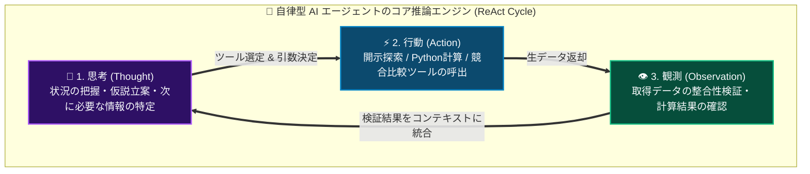
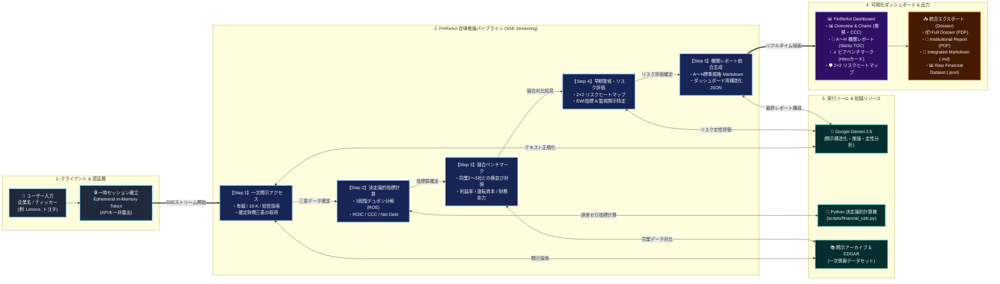

# FinReAct Intelligence Platform
## 公式開示情報に基づく企業財務調査・分析 AIソリューション (Corporate Finance Analyst AI)

[](https://www.python.org/)
[](https://ai.google.dev/)
[](https://www.starlette.io/)
[]()
[]()

**FinReAct Intelligence Platform** は、企業の法定開示・公式一次情報を厳格な根拠とし、企業の財務状況、収益性、成長性、資本効率（デュポン分解）、資金繰り（CCC）、事業リスク、および競合ベンチマークを調査・分析・整理する機関投資家・経営企画水準の財務分析ソリューションです。

---

## 1. ソリューション概要 (Solution Overview)

本ソリューションは、上場企業・グローバル企業の開示書類（有価証券報告書、SEC Form 10-K/10-Q、決算短信、香港取引所年次報告等）を起点とし、シニア金融アナリスト水準の財務レポートをAIが安定的かつ再現的に生成できるよう設計されています。

### 💡 コアとなる3つの強み

1. **公式一次情報への厳格な立脚 (Primary Disclosures First)**:
   - 金融ポータルや二次報道、アナリスト予想数値を一次事実と混同せず、EDINET、TDnet、SEC EDGAR等の公式開示から数値を直接抽出・照合します。
   - すべての分析値に対象期間（FY/Q/TTM）、報告通貨、会計基準（IFRS / US GAAP / 日本基準）、連結/単体区分を併記します。

2. **Gemini LLM × 金融知識から結晶化させた「Corporate Financeスキル」**:
   - Google の最新マルチモーダル推論モデル **Gemini LLM**（`gemini-2.5-flash` / `gemini-2.5-pro` 等）の構造化データ抽出力・文脈理解力をコアエンジンに採用。
   - 単なる汎用プロンプトではなく、コーポレートファイナンス理論および投資銀行・リサーチ実務知見を凝縮した [`.agents/skills/corporate-finance-analyst/`](.agents/skills/corporate-finance-analyst/) スキルフレームワークを融合。
   - LLMの定性推論力と、四則演算誤差（ハルシネーション）を完全に排除する Python決定論的計算ロジック（`scripts/financial_calc.py`）をハイブリッド連携させています。

3. **中立的な意思決定支援 (Objective & Decision-Ready)**:
   - 株式の「買い」「売り」等の主観的投資推奨を厳禁とし、客観的な事実（Fact）、財務指標分析（Analysis）、仮説・リスク（Hypothesis）、未確認事項（Open Questions）を明確に峻別します。

---

## 2. Dashboard アプリの自律推論エージェントフロー (Agent Flow)

本リポジトリに同梱されている **FinReAct Interactive Dashboard** は、自律型AIエージェントの **ReAct（Reasoning + Acting + Observation）フレームワーク** に基づき、リアルタイムに思考プロセスをストリーミング配信しながら財務調査を完遂します。

視覚的な理解を深めるため、本システムは **「(1) 各ステップで実行される自律思考・行動のコアサイクル（ミクロ構造）」** と **「(2) 調査開始からダッシュボード描画までの5段階パイプライン（マクロ構造）」** の2層構造で可視化しています。

---

### (1) ReAct コア推論ループ（各ステップ共通の思考・行動エンジン）

AIエージェントは各段階において、あらかじめ固定されたスクリプトを機械的に実行するのではなく、**「現状の把握と推論（Thought）」→「外部ツール呼び出し（Action）」→「実行結果の検証・数値照合（Observation）」** の自律サイクルを回しながら次のアクションを決定します。



---

### (2) 5段階エンドツーエンド処理パイプライン (End-to-End Architecture)

ユーザーからの企業リクエストを受け取り、エフェメラルセッションを通じて5つの自律フェーズを逐次完遂し、ダッシュボードおよびエクスポート用データへと変換するシステム全体の連携フローです。



---

### 📋 各ステップの自律処理内容と成果物

| ステップ | 主な思考（Thought） | 実行ツール（Action） | 検証・成果物（Observation） |
|---|---|---|---|
| **Step 1**<br>一次開示アクセス | 企業の開示体系、報告通貨、会計基準（IFRS / US-GAAP / 日本基準）を特定し、調査計画を策定 | `retrieve_primary_disclosures`<br>(EDINET / SEC EDGAR / 取引所開示) | 過去複数期の貸借対照表（B/S）、損益計算書（P&L）、キャッシュフロー計算書（C/F）の確定数値を抽出 |
| **Step 2**<br>決定論的指標計算 | 四則演算ハルシネーションを完全に排除するため、決定論的計算スクリプトを実行 | `compute_deterministic_ratios`<br>(`scripts/financial_calc.py`) | デュポン3段階分解（ROE = 純利益率 × 資産回転率 × 財務レバレッジ）、ROIC、現金循環日数（CCC）、Net Debt/EBITDAを確定 |
| **Step 3**<br>競合ピアベンチマーク | 同一市場またはグローバル競合他社との構造的差異を多面検証 | `benchmark_peers`<br>(同業2〜3社との横並び対照) | 営業利益率（OPM）、資本効率、運転資本サイクル、財務安全性のピアベンチマーク対照表および業界インプリケーションを作成 |
| **Step 4**<br>早期警戒・リスク評価 | 財務諸表注記・リスク情報から潜在的下振れ要因と早期警戒指標（EWI）を特定 | `evaluate_risk_ewi`<br>(影響度×確率の4象限評価) | 財務影響度（縦軸）× 発生確率（横軸）の 2×2 リスクヒートマップ（Critical / Severe / Moderate / Active）および確認すべき開示書類を特定 |
| **Step 5**<br>機関レポート統合 | 全検証データを集約し、機関投資家向け標準規格（A〜H）に準拠した調査パッケージを統合生成 | `synthesize_full_dossier`<br>(Markdown & JSON レポートビルダー) | A〜H完全Markdown、Chart.js用時系列データ、DuPontドライバー、CCC Waterfallバー、印刷用PDFレイアウトを完成 |

---

## 3. 実装に必要なコンポーネント (System Components & Architecture)

本ソリューションは、堅牢性・高速性・セキュリティを両立させるため、以下のコンポーネントで構成されています。

```
┌────────────────────────────────────────────────────────────────────────┐
│                        FinReAct Solution Architecture                  │
├───────────────────────────────────┬────────────────────────────────────┤
│   1. Backend & Server Engine      │   2. AI & Financial Logic          │
│   - Starlette ASGI (Fast, Async)  │   - Google GenAI SDK (Gemini)      │
│   - SSE Streaming (Real-time SSE) │   - Corporate Finance Analyst Skill│
│   - Ephemeral Session Store       │   - Deterministic Calc Engine      │
├───────────────────────────────────┼────────────────────────────────────┤
│   3. Security & Key Guard         │   4. Modern Frontend UI/UX         │
│   - In-Memory Token Exchange      │   - Collapsible ReAct Rail         │
│   - No Keys in URLs, Disk, or Logs│   - Chart.js 4.x Visualizations    │
│   - LocalStorage Client Isolation │   - Marked.js & html2pdf.js Export │
└───────────────────────────────────┴────────────────────────────────────┘
```

### コンポーネント一覧と役割

| コンポーネント | ファイルパス | 主要技術 / 役割 |
|---|---|---|
| **ASGI Webサーバー** | [`dashboard/server.py`](dashboard/server.py) | **Starlette + Uvicorn**。<br>・Server-Sent Events（SSE）によるリアルタイム推論ストリーミング。<br>・一時セッショントークン発行API（`/api/auth/session`）。<br>・静的アセット（HTML/CSS/JS）の高速ホスティング。 |
| **ReAct推論エンジン** | [`dashboard/agent_engine.py`](dashboard/agent_engine.py) | **Google GenAI SDK + 非同期ジェネレータ**。<br>・Gemini 2.5 Flash / Pro による動的財務データ抽出。<br>・検証済みプリセットデータセット（Lenovo, Toyota, Tesla, Apple, MSFT 等）。<br>・A〜H 機関レポート自動生成（`build_comprehensive_a_to_h_report`）。 |
| **決定論的財務計算機** | [`scripts/financial_calc.py`](scripts/financial_calc.py) | **Python標準ライブラリ（外部依存ゼロ）**。<br>・成長率（CAGR/YoY）、収益性（GPM/OPM）、デュポン分解、ROIC、CCC（DSO+DIO-DPO）、Net Debt倍率の厳密計算。 |
| **金融アナリストスキル** | [`.agents/skills/corporate-finance-analyst/`](.agents/skills/corporate-finance-analyst/) | **Antigravity AI Agent Skill**。<br>・`SKILL.md`: 行動原則、分析ルール、標準出力フォーマット定義。<br>・`references/`: 財務指標ガイド、一次情報源ガイド、早期警戒フレームワーク、レポートテンプレート。 |
| **フロントエンド UI/UX** | [`dashboard/static/`](dashboard/static/) | **Vanilla HTML5 / Modern CSS / JavaScript**。<br>・`index.html`: グリッドレイアウト、折りたたみレール、4タブ構成。<br>・`css/style.css`: 金融機関向けダークテーマ、グラスモーフィズム、レスポンシブ設計。<br>・`js/app.js`: SSE接続、TOCジャンプ、Waterfallバー計算、統合エクスポート。<br>・`js/charts.js`: Chart.js による財務推移 & FCFクオリティ描画。 |
| **セキュリティ機構** | [`dashboard/server.py`](dashboard/server.py), [`app.js`](dashboard/static/js/app.js) | **Ephemeral Session Token Pattern**。<br>・APIキーをGET URLのクエリパラメータやディスク、ログに一切露出させず、POST通信によるインメモリUUIDトークンへ変換して保護。 |
| **環境構築ブートストラップ** | [`dashboard/run_dashboard.bat`](dashboard/run_dashboard.bat) | **Windows環境向けバッチスクリプト**。<br>・ローカル仮想環境（`.venv`）の自動検知・作成、pip依存の自動インストール、サーバー起動、ブラウザ自動立ち上げを一括実行。 |

---

## 4. ディレクトリ構成 (Repository Structure)

```
H:\Agent-Finance/
├── .agents/
│   └── skills/
│       └── corporate-finance-analyst/            # コーポレートファイナンス実務スキル
│           ├── SKILL.md                          # エージェント行動規範・標準ワークフロー定義
│           ├── references/
│           │   ├── financial_metrics_guide.md    # 財務分析指標・算式・会計基準調整ガイド
│           │   ├── primary_disclosure_sources.md # 一次情報収集・法定開示書類精読ガイド
│           │   ├── report_templates.md           # 標準レポート（A〜H）& 役員向け1枚メモ テンプレート
│           │   └── risk_early_warning_framework.md # リスク分析 & 早期警戒指標フレームワーク
│           ├── examples/
│           │   └── sample_toyota_vs_tesla.md     # トヨタ vs テスラ 実践分析サンプルレポート
│           └── scripts/
│               └── financial_calc.py             # スキル同梱の財務計算スクリプト
├── dashboard/                                    # FinReAct Webダッシュボードアプリ
│   ├── run_dashboard.bat                         # venv構築・依存導入・アプリ起動ワンクリックバッチ
│   ├── requirements.txt                          # Starlette, Uvicorn, Google-GenAI, dotenv
│   ├── .env.example                              # 環境変数テンプレート（GEMINI_API_KEY等）
│   ├── server.py                                 # ASGI Webサーバー & セキュアセッション管理
│   ├── agent_engine.py                           # ReAct推論エンジン & A〜Hレポートビルダー
│   └── static/                                   # フロントエンド資産
│       ├── index.html                            # ダッシュボードHTML（折りたたみレール、TOC、ヒートマップ）
│       ├── css/
│       │   └── style.css                         # プロフェッショナル金融デザインCSS
│       └── js/
│           ├── app.js                            # UIコントローラー、SSEクライアント、エクスポート
│           └── charts.js                         # Chart.js グラフ初期化・更新モジュール
├── INPUT/                                        # コーポレートファイナンス理論・専門書PDF資料群
├── scripts/
│   └── financial_calc.py                         # ルート直下から即座に実行可能な計算スクリプト
├── AGENTS.md                                     # ワークスペース内AIエージェント向け行動原則
├── user_intake_template.md                       # 依頼開始用ユーザー入力テンプレート
└── README.md                                     # 本ドキュメント
```

---

## 5. クイックスタート & 使い方 (Quickstart & Usage)

### 方法 A: Dashboard Web アプリの起動 (推奨)

最も直感的に財務分析とAI推論プロセスを確認できる方法です。

#### 1. ワンクリック起動 (Windows)
エクスプローラーから [`dashboard/run_dashboard.bat`](dashboard/run_dashboard.bat) をダブルクリックして実行します。
自動的に以下の処理が行われます：
- ローカル Python 仮想環境（`.venv`）の作成
- 必要な依存ライブラリ（`requirements.txt`）の自動インストール
- サーバー起動（`http://localhost:8080`）
- 既定のWebブラウザでダッシュボードを自動オープン

#### 2. コマンドラインからの手動起動
```bash
# 仮想環境のアクティベート
cd /d H:\Agent-Finance
python -m venv .venv
.venv\Scripts\activate

# 依存パッケージのインストール
pip install -r dashboard/requirements.txt

# サーバーの起動
python dashboard/server.py
```
ブラウザで `http://localhost:8080/` を開きます。

#### 3. Gemini API キーとモデルの設定
- 画面右上の **🔑 Settings** または **🤖 モデルバッジ** をクリック。
- お手持ちの Google Gemini API キーを入力して「Save Settings」をクリックします。
- 使用するモデル（`gemini-2.5-flash`, `gemini-2.5-pro` 等）を選択できます。直前に選択したモデルはブラウザ内に自動記憶されます。
- ※ APIキーを設定しない場合でも、検証済みプリセット企業（Lenovo, Toyota, Tesla, Sony, Apple, MSFT, Honda）の完全分析とデモ推論が利用可能です。

---

### 方法 B: Antigravity IDE での呼び出し (AI Agent Workflow)

本リポジトリ内の [`.agents/skills/corporate-finance-analyst/`](.agents/skills/corporate-finance-analyst/) は、Antigravity の Workspace Skill として自動認識されます。

チャット上で直接エージェントに分析を依頼するか、[`user_intake_template.md`](user_intake_template.md) をコピー＆ペーストしてプロンプトを入力してください：

```text
「トヨタ自動車（7203.T）の直近3期の有報と決算短信を一次情報として調査し、
デュポン分解、CCC、およびテスラとの競合比較を含めたA〜H標準レポートを作成してください。」
```

エージェントが自動的に当スキルと `scripts/financial_calc.py` を呼び出し、一次情報に基づくレポートを生成します。

---

### 方法 C: 財務計算スクリプトの単体実行 (Deterministic Calculation)

同梱の `financial_calc.py` は、外部ライブラリを一切使わず Python 標準機能のみで動作します。

```bash
# デモ実行（トヨタ自動車の実績データによるシミュレーション）
python scripts/financial_calc.py --demo

# カスタムJSONファイルからの計算
python scripts/financial_calc.py --file path/to/financials.json
```

---

## 6. 分析範囲と標準出力フォーマット (Standard A〜H Format)

生成される完全レポート（Full Institutional Report）は、以下の 8部構成（A〜H規格）に統一されています：

```
A. エグゼクティブサマリー (Executive Summary)
   ├─ 総合結論（3〜5行）
   ├─ ポジティブ要因 Top 3 / 懸念要因・ボトルネック Top 3
   └─ 経営注視点 & 分析信頼度・情報制約評価
B. 企業概要・事業構造概要 (Business Profile & Structure)
   ├─ 正式企業名 / ティッカー / 本社 / 上場市場
   ├─ 会計基準（IFRS/US-GAAP/日本基準）/ 報告通貨
   └─ セグメント別売上・利益構成 / 主要収益ドライバー
C. 財務ハイライト（時系列推移） (Multi-Year Trajectory)
   ├─ 過去3〜5期の損益計算書（P&L）確定推移表（YoY / CAGR付）
   ├─ 貸借対照表（B/S）主要項目推移
   └─ キャッシュフロー計算書（C/F: 営業CF, 投資CF, FCF）推移
D. 主要財務指標一覧（算式付き） (Key Financial Ratios)
   ├─ 収益性指標（売上総利益率、営業利益率、EBITDAマージン）
   ├─ 資本効率指標（ROE、ROA、ROIC vs WACC）
   ├─ 運転資本効率（DSO、DIO、DPO、現金循環日数 CCC）
   └─ 安全性指標（自己資本比率、Net Debt / EBITDA、インタレスト・カバレッジ）
E. 資本効率・資金繰り・運転資本分析 (Capital Efficiency & CCC Breakdown)
   ├─ 3段階デュポンツリー分解（売上高純利益率 × 総資産回転率 × 財務レバレッジ）
   ├─ 主要ドライバー特定（レバレッジ主導 vs マージン主導 vs 資産回転主導）
   └─ マイナス運転資本（自己金融型モデル）の持続性評価
F. 競合比較（ピアベンチマーク多面分析） (Peer Benchmarking Matrix)
   ├─ 同業他社2〜5社との横並び多面比較テーブル
   └─ 業界シェア、OPM格差、CCC格差、財務余力インプリケーション
G. リスクマトリクス & 早期警戒指標 (Risk Matrix & Early Warning Indicators)
   ├─ 財務波及経路、重要度（高/中/低）、発生確率（高/中/顕在化）
   ├─ 2×2 リスクヒートマップ（Critical / Severe / Moderate / Active）
   └─ 早期警戒指標（EWI）および定点観測すべき開示書類注記
H. 経営への示唆・論点 & 一次情報出典一覧 (Strategic Recommendations & Sources)
   ├─ 経営・財務戦略への具体的提言（資本配分、マージン改善、運転資本防衛）
   └─ 法定開示・一次情報出典一覧（資料名、開示日、公式URL、注記番号）
```

---

## 7. 設計原則とコンプライアンス (Governance & Compliance)

- **一次情報最優先の徹底**: 金融ポータルの二次集計データに依存せず、各国の証券取引所・規制当局に提出された一次開示書類を根拠とします。
- **事実・分析・仮説の分離**: 開示された客観的数値（Fact）、指標から論理的に導かれる分析（Analysis）、将来のリスク・見通しに関する推論（Hypothesis）を明確に区分します。
- **機密保持・セキュリティの遵守**: APIキーをGitで管理せず、ローカルストレージと一時インメモリトークンのみで扱います。リポジトリ外部への無断送信は一切行いません。
- **投資助言の厳禁**: 本ソリューションは意思決定者向けの客観的な論点整理・財務分析に徹し、有価証券の売買推奨や投資判断は行いません。

---

*FinReAct Intelligence Platform — Built with Google Gemini, Antigravity Agentic Architecture, and Corporate Finance Analyst Standards.*
